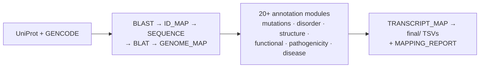

# DisCanVisFlow — Disease & Disorder Annotation for Human Protein Isoforms

> A Nextflow DSL2 pipeline that maps disease variants, functional annotations, and structural features onto every curated protein isoform in the human SwissProt proteome. Built to power the DisCanVis2 web server, but fully usable as a standalone data-generation pipeline for proteomics, structural biology, or ML feature pipelines.

---

## What it does

For each human protein (UniProt SwissProt × GENCODE), the pipeline:

1. **Maps each GENCODE transcript to its best UniProt isoform** via reciprocal BLASTP
2. **Builds a per-residue coordinate map** (protein position ↔ codon ↔ hg38 position) via BLAT
3. **Runs 20+ annotation modules**, producing DB-ready, `Protein_ID`-keyed TSVs:

| Category | Annotations |
|----------|-------------|
| Mutations | ClinVar (pathogenic/likely-pathogenic), TCGA MAF, cBioPortal MAF, custom VCF |
| Disorder | IUPred3, ANCHOR2, AIUPred disorder, AIUPred-Binding, AlphaFold pLDDT, Combined disorder |
| SLiMs & PTMs | ELM motifs, DIBS, MFIB, PhasePro, PTMdb, PhosphoSite, Pfam domains, UniProt ROI/binding |
| Structure | PDB coverage, unobserved regions, RSA scores |
| Polymorphism | dbSNP 155 common SNPs + allele frequencies |
| Pathogenicity | dbNSFP, AlphaMissense, MaveDB, ProteinGym |
| Disease | ClinVar disease ontology (MONDO), OMIM disease + mutations |
| Interactions | IntAct, BioGRID, HIPPIE |
| Gene function | GO terms (GOA), ScanSite phospho motifs, PEM core motifs |
| Conservation | GOPHER multi-level, phastCons per-residue |
| Cancer | CGC census, Compendium, DepMap somatic mutations |

All outputs use `Protein_ID` (the GENCODE transcript name, e.g. `RAF1-201`) as the primary key and land in `results/<project>/final/`.



The full process-level DAG, module tables, and design decisions are in
[docs/architecture.md](docs/architecture.md).

---

## Quick start

**1. Install** (conda; see [Installation](docs/installation.md) for local references and disorder predictors):

```bash
git clone https://github.com/Nosyfire/DisCanVisFlow
cd DisCanVisFlow
conda env create -f environment.yml
conda activate discanvis
```

**2. Run one gene.** In the default (portable) mode, all open references download
automatically on first run:

```bash
nextflow run main.nf --project test_one_protein --machine medium --target_gene RAF1 -resume
```

**3. Run the full proteome:**

```bash
nextflow run main.nf --project discanvis --machine hard -resume
```

Outputs land in `results/<project>/final/`. To validate the workflow graph
without computing anything, add `-stub`.

That is the happy path. Everything else — other machines, module selection,
mutation inputs (MAF/VCF), gene lists, SLURM, Docker, and every flag — is in the
[Configuration guide](docs/configuration_guide.md).

---

## Output structure

```
results/<project>/
├── final/               ALL DB-ready, Protein_ID-keyed TSVs, grouped by category:
│                        annotations/ disorder/ genome/ mutations/ pathogenicity/
│                        pdb/ disease/ drivers/ conservation/ position/ sequence/
├── intermediate/        Entry_Isoform-keyed staging TSVs (input to TRANSCRIPT_MAP)
└── mapping_reports/     mapping_summary.md · release.json · mapping_coverage.tsv
```

The full per-file breakdown of `final/` is in
[docs/architecture.md § Outputs](docs/architecture.md#outputs-resultsproject).
The meaning of every annotation column/track is documented per track under
[docs/annotations/](docs/annotations/README.md).

---

## Documentation

| I want to… | Read |
|------------|------|
| Install it & set up references / predictors | [docs/installation.md](docs/installation.md) |
| See every flag, project, machine, and run recipe | [docs/configuration_guide.md](docs/configuration_guide.md) |
| Understand the pipeline structure (DAG, modules, outputs) | [docs/architecture.md](docs/architecture.md) |
| Know what an annotation column/track means | [docs/annotations/](docs/annotations/README.md) |
| Understand isoform mapping & annotation transfer | [docs/isoform_mapping.md](docs/isoform_mapping.md) |
| Understand conservation scores (GOPHER + phastCons) | [docs/conservation_calculation.md](docs/conservation_calculation.md) |
| Know where reference data comes from & how to refresh it | [docs/reference_data.md](docs/reference_data.md) |
| Estimate runtime & tune performance | [docs/performance.md](docs/performance.md) |
| Fix a failing or empty-output run | [docs/troubleshooting.md](docs/troubleshooting.md) |
| Cite the tools & databases | [CITATIONS.md](CITATIONS.md) |

---

## Citation

If you use this pipeline, please cite the tools and databases listed in
[CITATIONS.md](CITATIONS.md).
