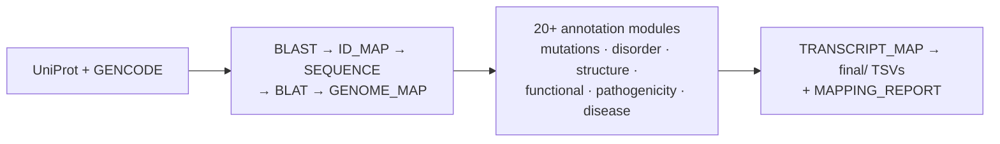

# DisCanVisFlow — Disease & Disorder Annotation for Human Protein Isoforms

> A Nextflow DSL2 pipeline that maps disease variants, functional annotations, and structural features onto every curated protein isoform in the human SwissProt proteome. Built to power the DisCanVis2 web server, but fully usable as a standalone data-generation pipeline for proteomics, structural biology, or ML feature pipelines.

---

## What it does

For each human protein (UniProt SwissProt × GENCODE), the pipeline:

1. **Maps each GENCODE transcript to its best UniProt isoform** via reciprocal BLASTP
2. **Builds a per-residue coordinate map** (protein position ↔ codon ↔ hg38 position) via BLAT
3. **Runs 20+ annotation modules**, producing DB-ready, `Protein_ID`-keyed TSVs:

| Category | Annotations |
|----------|-------------|
| Mutations | ClinVar (pathogenic/likely-pathogenic) + per-variant submission dates, TCGA MAF, cBioPortal MAF, custom VCF |
| Disorder — predicted | IUPred3, ANCHOR2, AIUPred disorder, AIUPred-Binding, AlphaFold pLDDT, Combined disorder |
| Disorder — curated | **DisProt** (literature-curated IDRs with IDPO/GO terms), MobiDB consensus |
| SLiMs & motifs | ELM motifs (+ classes, switches), PEM core motifs, ScanSite phospho motifs, DIBS, MFIB, PhasePro |
| PTMs & domains | PTMdb, PhosphoSite, Pfam domains, UniProt ROI/binding |
| Structure | PDB coverage, unobserved regions, RSA scores, DSSP secondary structure, SEG low-complexity regions |
| Aggregation | AGGRESCAN a3v aggregation-prone regions |
| Phase separation | catGRANULE, PLAAC, plus curated PhaSepDB / LLPSDB / DisPhaseDB regions and variants |
| Polymorphism | dbSNP 155 common SNPs + allele frequencies |
| Pathogenicity | dbNSFP (37 predictors + CADD + gnomAD 4.1 AF), AlphaMissense, MaveDB, ProteinGym, FINCHES |
| Disease | ClinVar disease ontology (MONDO), OMIM disease + mutations |
| Interactions | IntAct, BioGRID, HIPPIE |
| Gene function | GO terms (GOA), exon boundaries |
| Conservation | GOPHER multi-level, phastCons per-residue |
| Cancer | CGC census, Compendium, DepMap somatic mutations |

All outputs use `Protein_ID` (the GENCODE transcript name, e.g. `RAF1-201`) as the primary key and land in `results/<project>/final/`.


```mermaid
flowchart LR
    IN["UniProt + GENCODE"] --> MAP["BLAST → ID_MAP → SEQUENCE<br/>→ BLAT → GENOME_MAP"]
    MAP --> ANN["20+ annotation modules<br/>mutations · disorder · structure ·<br/>functional · pathogenicity · disease"]
    ANN --> OUT["TRANSCRIPT_MAP → final/ TSVs<br/>+ MAPPING_REPORT"]
```

The full process-level DAG, module tables, and design decisions are in
[the architecture doc](docs/pipeline/architecture.md).

---

## Quick start

### Option A — run straight from GitHub (no clone)

Nextflow can pull and run the pipeline itself. Nothing to clone; the repo is
cached under `~/.nextflow/assets/Nosyfire/DisCanVisFlow`:

```bash
# Nextflow itself (once), if you don't have it:
curl -s https://get.nextflow.io | bash && sudo mv nextflow /usr/local/bin/

# Pull + run one gene — references download automatically on first run
nextflow run Nosyfire/DisCanVisFlow -latest \
    --project test_one_protein --machine medium --target_gene RAF1 -resume

# Pin an exact revision for reproducibility (recommended for real runs).
# No release tags are published yet, so pin by commit SHA:
nextflow run Nosyfire/DisCanVisFlow -r ec7d26d \
    --project discanvis --machine hard -resume
```

| Flag | Meaning |
|------|---------|
| `-latest` | Pull the newest commit on the default branch (`main`) before running |
| `-r <tag\|branch\|commit>` | Run a specific revision — pin by commit SHA (or tag, once tagged releases exist) |
| `-resume` | Reuse cached tasks from a previous run |
| `-stub` | Validate the workflow graph without executing any worker |

Useful housekeeping commands:

```bash
nextflow info Nosyfire/DisCanVisFlow    # show cached revisions
nextflow pull Nosyfire/DisCanVisFlow    # update without running
nextflow drop Nosyfire/DisCanVisFlow    # delete the cached copy
```

> The pipeline still needs the `discanvis` conda environment for its workers.
> Either create it from a clone (Option B) once, or add `--env docker` to run
> every process in the container instead.

### Option B — clone (for development, `--data local`, or editing configs)

**1. Install** (conda; see [Installation](docs/guide/installation.md) for local references and disorder predictors):

```bash
git clone https://github.com/Nosyfire/DisCanVisFlow
cd DisCanVisFlow
conda env create -f environment.yml
conda activate discanvis
```

**2. Run one gene.** In the default (portable) mode, all open references download
automatically on first run:

```bash
nextflow run main.nf --project test_one_protein --machine medium --target_gene RAF1 -resume
```

**3. Run the full proteome:**

```bash
nextflow run main.nf --project discanvis --machine hard -resume
```

Outputs land in `results/<project>/final/`. To validate the workflow graph
without computing anything, add `-stub`.

### Common variations

**Your own gene list** — a plain-text file, one HGNC symbol per line, `#` for
comments. Overrides `--target_gene`:

```bash
cat > my_genes.txt <<'EOF'
# Kinases of interest
RAF1
BRAF
KRAS
EOF

nextflow run main.nf --project discanvis --machine medium \
    --gene_list_file my_genes.txt -resume
```

**Only some annotations** — `--modules` takes a comma-separated list and runs
*only* those groups (plus the always-on backbone: ELM, Pfam, DIBS, MFIB,
PhasePro, PTM). Much faster than a full run:

```bash
# Variants + disorder only — no PDB, GO, conservation, PPI, phase separation
nextflow run main.nf --project test_one_protein --machine medium --target_gene RAF1 \
    --modules mutations,disorder -resume

# An IDP-focused set: predicted disorder + both curated disorder databases
nextflow run main.nf --project discanvis --machine medium \
    --gene_list_file my_genes.txt \
    --modules disorder,disprot,mobidb,lcr,apr -resume

# Curated evidence only — DisProt + MobiDB, no predictors at all
nextflow run main.nf --project test_one_protein --machine medium --target_gene RAF1 \
    --modules disprot,mobidb -resume
```

**Drop one predictor inside a module** — `--skip_*` flags are finer-grained than
`--modules`:

```bash
# Keep AIUPred, skip IUPred3/ANCHOR2 (which need a separate conda env)
# and skip the slow AlphaFold pLDDT fetch
nextflow run main.nf --project test_one_protein --machine medium --target_gene RAF1 \
    --modules disorder --skip_iupred true --skip_alphafold true -resume
```

**Pull one gene out of a finished full run** — no recomputation, seconds not hours:

```bash
python bin/extract_gene_from_results.py \
    --source results/discanvis --gene RAF1,BRAF,KRAS --out results/kinase_subset
```

That is the happy path. Everything else — other machines, the full
[`--modules` name list](docs/guide/configuration.md#--modules--run-only-what-you-need),
mutation inputs (MAF/VCF), SLURM, Docker, and every flag — is in the
[Configuration guide](docs/guide/configuration.md).

---

## Output structure

```
results/<project>/
├── final/               ALL DB-ready, Protein_ID-keyed TSVs, grouped by category:
│                        annotations/ disorder/ genome/ mutations/ pathogenicity/
│                        structure/ phase_separation/ disease/ drivers/
│                        conservation/ position/ sequence/
├── intermediate/        Entry_Isoform-keyed staging TSVs (input to TRANSCRIPT_MAP)
└── mapping_reports/     mapping_summary.md · release.json · mapping_coverage.tsv
```

The full per-file breakdown of `final/` is in
[the architecture doc](docs/pipeline/architecture.md#outputs-resultsproject).
The meaning of every annotation column/track is documented per track under
[docs/annotations/](docs/annotations/README.md).

---

## Documentation

The docs are split by concern: **[guide/](docs/guide)** (running it),
**[pipeline/](docs/pipeline)** (how it works), and
**[annotations/](docs/annotations/README.md)** (what each output means).

**Getting started & operations** — [docs/guide/](docs/guide)

| I want to… | Read |
|------------|------|
| Install it & set up references / predictors | [Installation](docs/guide/installation.md) |
| See every flag, project, machine, and run recipe | [Configuration](docs/guide/configuration.md) |
| Know where reference data comes from & how to refresh it | [Reference data](docs/guide/reference_data.md) |
| Estimate runtime & tune performance | [Performance](docs/guide/performance.md) |
| Fix a failing or empty-output run | [Troubleshooting](docs/guide/troubleshooting.md) |

**How it works** — [docs/pipeline/](docs/pipeline)

| I want to… | Read |
|------------|------|
| Understand the pipeline structure (DAG, modules, outputs) | [Architecture](docs/pipeline/architecture.md) |
| Understand isoform mapping & annotation transfer | [Isoform mapping](docs/pipeline/isoform_mapping.md) |
| Understand conservation scores (GOPHER + phastCons) | [Conservation method](docs/pipeline/conservation_method.md) |

**Annotation reference** — [docs/annotations/](docs/annotations/README.md)

| I want to… | Read |
|------------|------|
| Know what an annotation column/track means | [Annotation index](docs/annotations/README.md) |
| Cite the tools & databases | [CITATIONS.md](CITATIONS.md) |
| Check what you may use commercially | [CITATIONS.md § Licence summary](CITATIONS.md#0-licence-summary--what-you-may-use-and-how) |

---

## Licence

DisCanVisFlow's own code — the workflow, the Python workers, the configs, and
these docs — is released under the [MIT licence](LICENSE).

The reference data and prediction tools the pipeline downloads or invokes are
**not** covered by that licence and carry their own terms; several are
non-commercial or require registration (IUPred3, dbNSFP, COSMIC, OMIM,
AlphaMissense, FINCHES, PhosphoSitePlus, ELM, BLAT…). Before using the pipeline
commercially, read the
[licence summary](CITATIONS.md#0-licence-summary--what-you-may-use-and-how),
which lists what to disable and how.

## Citation

If you use this pipeline, please cite the tools and databases listed in
[CITATIONS.md](CITATIONS.md).
