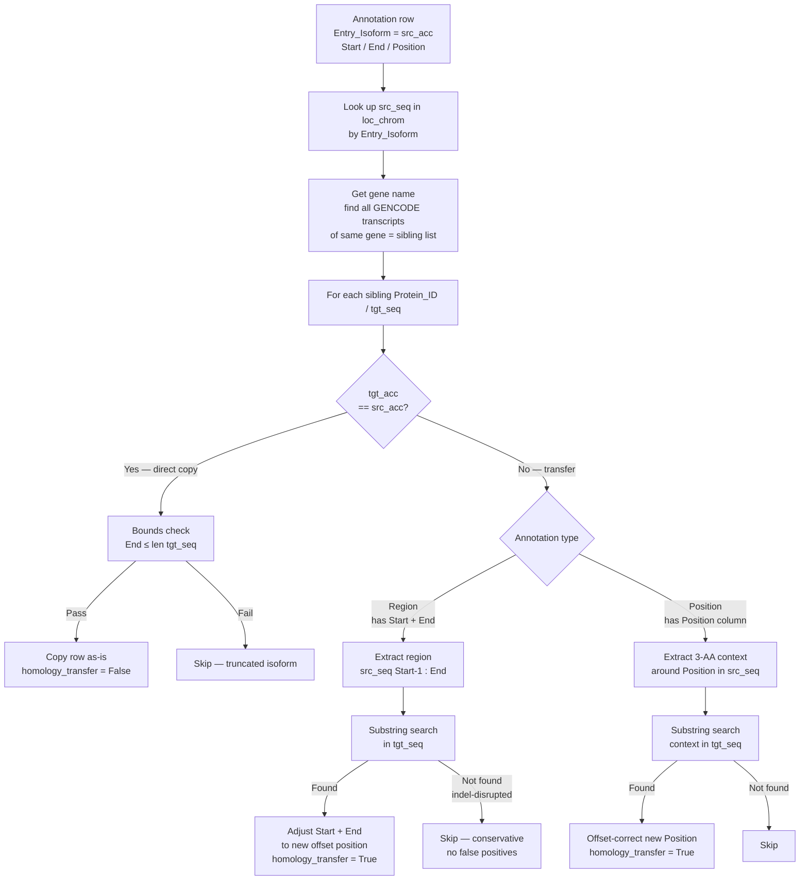

# Isoform Mapping Logic

## 1. The Core Problem

UniProt SwissProt stores **one canonical sequence per gene**. For RAF1 this is accession `P04049`, representing the primary protein sequence. However, GENCODE encodes the same gene as multiple transcripts — RAF1 has five protein-coding transcripts: `RAF1-201` through `RAF1-262`. Each of these may differ by alternative splicing, differing N-terminal extensions, or minor isoform differences.

Functional annotations (ELM motifs, PTMs, Pfam domains, disorder regions, etc.) are all deposited and curated against the **UniProt canonical sequence**. DisCanVis2, however, serves per-residue data for every GENCODE transcript individually, because the web server's `Protein_ID` primary key is the GENCODE transcript name.

The isoform mapping system solves this mismatch: it takes every UniProt-keyed annotation and transfers it to all GENCODE transcripts of the same gene, with correct per-transcript residue numbering.

---

## 2. How BLAST Maps UniProt → GENCODE (Modules 0–1)

The pipeline performs **reciprocal BLASTP** to establish sequence identity between UniProt and GENCODE protein sequences.

```mermaid
flowchart TD
    UNI[UniProt SwissProt FASTA] --> SUB_UNI[SUBSET_FASTA\nexact gene match: GN=RAF1 ]
    GEN[GENCODE translations FASTA] --> SUB_GEN[SUBSET_FASTA\nexact gene match: |RAF1| ]
    SUB_UNI --> MKDB_UNI[MAKEBLASTDB UniProt]
    SUB_GEN --> MKDB_GEN[MAKEBLASTDB GENCODE]
    MKDB_GEN --> BP1[BLASTP: GENCODE → UniProt DB]
    MKDB_UNI --> BP2[BLASTP: UniProt → GENCODE DB]
    SUB_UNI --> BP1
    SUB_GEN --> BP2
    BP1 --> MERGE[MERGE_BLAST_HITS\nbest hit per query]
    BP2 --> MERGE
    MERGE --> IDMAP[ID_MAP\ncreate_id_map_worker.py]
    IDMAP --> OUT[bestmaps_blast_gene_transcript.tsv\nProtein_ID | Entry_Isoform | coverage | alignmentpuntcuality]
```

**Exact gene subsetting** prevents false matches:
- GENCODE FASTA headers use pipe-delimited fields: `|RAF1|` guards against `TRAF1`, `ZTRAF1`, etc.
- UniProt FASTA headers use `GN=RAF1 ` (trailing space) for the same purpose.

The output `bestmaps_blast_gene_transcript.tsv` contains one row per (Protein_ID, Entry_Isoform) pair with two quality columns:

- **`coverage`**: fraction of the query aligned (0–1). For RAF1, all 5 GENCODE isoforms align to P04049 with coverage 98.5–100%.
- **`alignmentpuntcuality`**: categorical quality indicator (see Section 6).

---

## 3. The Isoform Identity Table

`loc_chrom_with_names_isoforms_with_seq.tsv` is the central reference table produced by Module 2 (`SEQUENCE_PROCESS`). It is the isoform→UniProt mapping table used by every downstream module.

### Key Columns

| Column | Description |
|--------|-------------|
| `Protein_ID` | GENCODE transcript name (e.g. `RAF1-201`) — primary key for all mapped outputs |
| `Entry_Isoform` | UniProt accession the transcript was BLAST-matched to (e.g. `P04049`) |
| `coverage` | BLAST alignment coverage (fraction of transcript covered) |
| `alignmentpuntcuality` | `identical` or `aligned` (see Section 6) |
| `Sequence` | Full amino acid sequence of this GENCODE transcript |
| `Gene_Gencode` | Gene name from GENCODE (e.g. `RAF1`) |
| `Chromosome` | Chromosome (e.g. `chr3`) |
| `Strand` | `+` or `-` |

For RAF1, all five GENCODE transcripts map to `P04049` with high coverage, reflecting that the isoforms differ only in short regions (alternative first exons, minor splice variants).

---

## 4. Annotation Transfer Logic (`create_transcript_map_worker.py`)

Module 5e (`TRANSCRIPT_MAP`) iterates over every annotation row — which is keyed by `Entry_Isoform` (UniProt accession) — and transfers it to all GENCODE transcripts of the same gene.



### Transfer Rules Summary

| Scenario | Condition | Action | `homology_transfer` |
|----------|-----------|--------|---------------------|
| Same isoform | `tgt_acc == src_acc` | Copy directly, bounds check only | `False` |
| Region on different isoform | Has `Start`/`End` columns | Exact substring search of region in target | `True` if found |
| Position on different isoform | Has `Position` column | 3-AA context window search in target | `True` if found |
| Region not found | Indel disrupts the region | Skip (dropped conservatively) | — |

Every mapped row in `final/` carries three provenance columns:

| Column | Values | Meaning |
|--------|--------|---------|
| `mapping_type` | `direct` / `homology_similarity` | `direct` = same UniProt accession (source == target); `homology_similarity` = transferred to a different isoform by sequence match |
| `homology_transfer` | `True` / `False` | Boolean form of the above (`True` ⇔ `mapping_type = homology_similarity`) |
| `homology_identity` | 0–1 | Sequence identity of the transfer; homology rows are only kept at ≥ `--homology_min_identity` (default `0.90`) |

The `--only_main_isoforms` flag restricts transfer to only the main GENCODE isoform (the one with `alignmentpuntcuality = identical`), which reduces runtime at the cost of missing transfers to alternative transcripts.

---

## 5. Limitations and What `homology_transfer=True` Means

### What it means

`homology_transfer=True` in the output TSV flags rows where the annotation was **transferred from a different UniProt accession** to a GENCODE transcript using sequence-based matching. The residue coordinates in that row reflect the target transcript's numbering, not the source's.

DisCanVis2 uses this flag to:
- Distinguish directly-matched annotations from inferred ones
- Optionally filter to high-confidence annotations only
- Display a visual indicator in the protein viewer

### Conservative design

The substring matching approach is **conservative by design**: it only transfers annotations when the exact peptide sequence (for regions) or 3-AA flanking context (for positions) is found in the target isoform. If an insertion or deletion disrupts the region between the two isoforms, the annotation is dropped rather than guessed.

This means:
- **No false positives**: transferred annotations are always sequence-supported
- **~5–15% loss**: short isoform-divergent regions (alternative exons, N-terminal extensions) are not transferred

### The legacy ClustalW alternative

The legacy DisCanVis pipeline used ClustalW multiple sequence alignment to handle indel-disrupted regions. This allows transfer across gaps but requires parsing CIGAR-style alignment strings and is substantially more complex. The current substring approach was chosen for simplicity and correctness; the ClustalW path may be re-introduced if transfer rates need to improve.

---

## 6. BLAST Alignment Quality: `alignmentpuntcuality`

The `alignmentpuntcuality` column (spelling preserved from the legacy pipeline) categorizes the quality of each UniProt ↔ GENCODE transcript match:

| Value | Meaning | Typical cause |
|-------|---------|--------------|
| `identical` | 100% sequence identity over full coverage | Main isoform; UniProt canonical = GENCODE main transcript |
| `aligned` | < 100% coverage or < 100% identity | Isoform differences: alternative splicing, N-terminal extensions, minor SNPs |

For RAF1:
- `RAF1-201` typically has `identical` — it corresponds to the UniProt canonical sequence
- `RAF1-204`, `RAF1-262` may have `aligned` — they include alternative N-terminal exons not in the UniProt canonical

When `--only_main_isoforms` is set, the pipeline restricts transcript-level mapping to isoforms with `alignmentpuntcuality = identical`.

Two coverage thresholds gate a match (both percentages, 0–100):

- `params.blast_coverage` (default `90`) — minimum BLAST alignment coverage in Module 0.
- `params.idmap_coverage` (default `95`) — minimum coverage for `ID_MAP` to accept a transcript → UniProt assignment in Module 1.

Pairs below these thresholds are excluded from `loc_chrom_with_names_isoforms_with_seq.tsv`.
