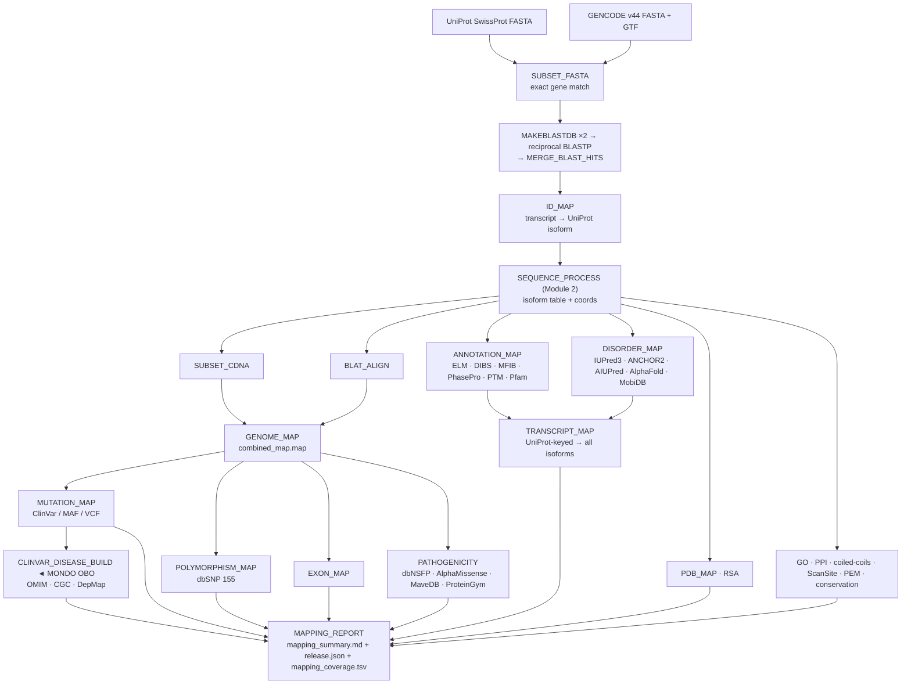

# DisCanVisFlow — Architecture

> Canonical reference for the pipeline DAG, modules, workers, design decisions,
> inputs, and outputs. The [README](../../README.md) is the entry point and quick
> start; this document is the depth behind it.

## What it does

DisCanVisFlow takes UniProt SwissProt + GENCODE as inputs and produces per-residue annotation TSVs for every human protein isoform. Each output is keyed by `Protein_ID` (GENCODE transcript name, e.g. `RAF1-201`) and is ready for database upload or downstream analysis.

The pipeline runs as one Nextflow DSL2 workflow with ~40 processes across 7 modules. Every process is independently cacheable via `-resume`; reference data is cached once in `references/` via `storeDir` and reused across runs.

---

## Data flow (DAG)

This is the canonical pipeline DAG. The README shows a simplified overview that
links here.



---

## Modules

| # | Module | Processes | Key output |
|---|--------|-----------|------------|
| 0 | BLAST search | `SUBSET_FASTA`, `MAKEBLASTDB`, `BLASTP`, `MERGE_BLAST_HITS` | `bestsequences.tsv` |
| 1 | ID mapping | `ID_MAP` | `bestmaps_blast_gene_transcript.tsv` |
| 2 | Sequence processing | `SEQUENCE_PROCESS` | `loc_chrom_with_names_isoforms_with_seq.tsv` |
| 3 | Genome mapping | `SUBSET_CDNA`, `BLAT_ALIGN`, `GENOME_MAP` | `combined_map.map`, `genome_protein_index.tsv` |
| 4 | Mutation mapping | `MUTATION_MAP` | Missense / Frameshift / Nonsense / Indel TSVs |
| 5 | Annotation mapping | `TRANSCRIPT_MAP` + 14 sub-modules | All `final/` annotation TSVs |
| 7 | Conservation | `CONSERVATION_MAP` | `conservation_multiple_level.tsv`, `conservation_phastcons.tsv` |
| 8 | Disease + pathogenicity | `CLINVAR_DISEASE_BUILD`, `PATHOGENICITY_MAP`, `ALPHAMISSENSE_MAP`, `DEPMAP_MAP` | disease/, pathogenicity/ TSVs |
| — | Reference fetches | `FETCH_*` (20 processes) | Cached in `references/` via `storeDir` |
| — | Mapping report | `MAPPING_REPORT` | `mapping_summary.md`, `mapping_coverage.tsv` |

---

## Annotation sub-modules (Module 5)

| Sub | Process | Worker | Output |
|-----|---------|--------|--------|
| 5a | `ANNOTATION_MAP` | `create_annotation_worker.py` | ELM, DIBS, MFIB, PhasePro, PTM, Pfam, UniProt ROI/binding |
| 5b | `DISORDER_MAP` | `create_disorder_worker.py` | IUPredscores, AnchorScores, AIUPredscores, AIUPredBinding, AlphaFoldTable, CombinedDisorderNew |
| 5c | `PDB_MAP` | `create_pdb_worker.py` | pdb_structures.tsv, pdb_missing.tsv |
| 5d | `EXON_MAP` | `create_exon_worker.py` | exon.tsv |
| 5e | `TRANSCRIPT_MAP` | `create_transcript_map_worker.py` | Protein_ID-keyed mapped copies of all annotation TSVs |
| 5f | `GO_MAP` | `create_go_worker.py` | go_terms.tsv |
| 5g | `POLYMORPHISM_MAP` | `create_polymorphism_worker.py` | polymorphism.tsv (rsid + allele freq from dbSNP 155) |
| 5h | `PEM_MAP` + `PEM_TRANSFER_MAP` | `create_pem_worker.py`, `create_pem_transfer_worker.py` | pem_core_motifs.tsv, pem_core_motifs_mapped.tsv |
| 5i | `COILEDCOILS_MAP` | `create_coiledcoils_worker.py` | coiled_coils.tsv, DeepCoil.tsv |
| 5j | `PPI_MAP` | `create_ppi_worker.py` | interactions.tsv (IntAct + BioGRID + HIPPIE) |
| 5k | `SCANSITE_MAP` | `create_scansite_worker.py` | scansite.tsv |
| 5m | `POSITION_MAP` | `create_position_based_worker.py` | position_based_annotations.tsv, rsa_scores.tsv |
| 5n | `ELM_CLASS_MAP` | `create_elm_class_worker.py` | elm_classes.tsv |
| 5o | `MOBIDB_MAP` | `create_mobidb_worker.py` | mobidb_disorder.tsv |

---

## Key design decisions

**`Protein_ID` as primary key** — all outputs use the GENCODE transcript name (e.g. `RAF1-201`). UniProt accessions appear only in intermediate staging files.

**`combined_map.map` as the coordinate backbone** — 8-column per-nucleotide table linking protein position ↔ codon ↔ genomic hg38 coordinate. Required by genome, mutation, exon, polymorphism, and conservation modules.

**`TRANSCRIPT_MAP` as annotation fan-out** — annotations are first collected per UniProt isoform (`Entry_Isoform`), then mapped to all GENCODE transcripts. Same UniProt accession → `mapping_type=direct`. Region transferred by sequence similarity → `mapping_type=homology_similarity` (threshold: `--homology_min_identity 0.90`).

**`storeDir` for all reference data** — FETCH_* processes write to fixed paths under `params.ref_dir` (`references/`). Nextflow skips the download if the file already exists, independently of `-resume` task caching.

**Batch subprocess for disorder predictors** — IUPred3 and AIUPred models are loaded once per chunk; all sequences in the chunk are scored in a single subprocess call (~0.07 s/protein vs ~13 s/protein with per-call loading).

**`--scatter_chunks N`** — splits the sequence table into N gene-balanced chunks so DISORDER_MAP and COILEDCOILS_MAP run as N concurrent tasks. Isoforms of the same gene always land in the same chunk. Default: 1. Full proteome: 20.

**PPI raw download** — IntAct, BioGRID, and HIPPIE are downloaded from their FTP/HTTP servers (`FETCH_INTACT/BIOGRID/HIPPIE`) and preprocessed once via `PPI_PREPROCESS` (cached in `references/ppi/processed/`). Supply `--ppi_intact/biogrid/hippie` to use pre-processed files instead.

**Mapping modes** — `main_isoform_mapping` (default for `raf1`/`full` profiles): BLASTs against canonical SwissProt only. `all_isoform_mapping` (default for `discanvis_data`): adds curated isoforms from `UP000005640_9606_additional.fasta` to the BLAST DB, then produces a 1:1 transcript → UniProt isoform assignment.

---

## Inputs

| Parameter | Description | Default |
|-----------|-------------|---------|
| `--uniprot_fasta` | UniProt SwissProt FASTA | auto-download |
| `--gencode_fasta` / `--gencode_gtf` / `--gencode_transcripts` | GENCODE v44 | auto-download |
| `--hg38_2bit` | hg38 2bit genome (BLAT + mutations) | auto-download (`--fetch_hg38_2bit true`) |
| `--clinvar_vcf` | ClinVar VCF | auto-download |
| `--dbsnp_bb` | dbSNP 155 bigBed (polymorphism) | auto-download (`--fetch_dbsnp true`) |
| `--alphamissense_gz` | AlphaMissense isoforms TSV.gz | auto-download |
| `--dbnsfp_raw_dir` | dbNSFP chr*.gz directory | `local.config` |
| `--target_gene` | Gene filter (`null` = full proteome) | null |
| `--gene_list_file` | Plain-text gene list (one HGNC name per line) | null |
| `--mutation_maf` | TCGA / cBioPortal MAF (alternative to ClinVar) | null |
| `--mutation_vcf` | Custom VCF (alternative to ClinVar) | null |

---

## Outputs (`results/<project>/`)

```
final/
├── sequence/        Isoform table with sequences, coordinates, MANE/APPRIS flags
├── genome/          combined_map.map, exon.tsv, genome_protein_index.tsv,
│                    genome_protein_mutations.tsv (every possible SNV reference table)
├── mutations/       ClinVar/, TCGA/, CBioportal/, DepMap/ — per-mutation-source TSVs
├── annotations/     ELM, DIBS, MFIB, PhasePro, PTM, Pfam, GO, polymorphism, PEM,
│                    coiled_coils, interactions, scansite, elm_classes,
│                    homology_similarity_manifest.tsv
├── disorder/        IUPredscores, AnchorScores, AIUPredscores, AIUPredBinding,
│                    AlphaFoldTable, CombinedDisorderNew, rsa_scores
├── pdb/             pdb_structures.tsv, pdb_missing.tsv
├── pathogenicity/   dbnsfp_scores.tsv, alphamissense.tsv,
│                    mavedb.tsv, proteingym.tsv
├── disease/         clinvar_disease.tsv, omim_disease.tsv,
│                    clinvar_disease_mutations.tsv, omim_mutations.tsv
├── drivers/         cancer_driver.tsv, census_driver.tsv, compendium_driver.tsv
├── conservation/    conservation_multiple_level.tsv, conservation_phastcons.tsv
└── position/        position_based_annotations.tsv
intermediate/        Entry_Isoform-keyed staging TSVs (inputs to TRANSCRIPT_MAP)
mapping_reports/
├── mapping_summary.md        Run metadata, tool versions, provenance, per-annotation coverage
└── mapping_coverage.tsv      Per-(Gene × annotation) flat coverage table (large runs)
```
