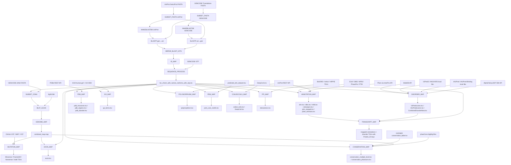

# DisCanVis Pipeline — Full Workflow Overview

## What the Pipeline Does

The DisCanVis Nextflow pipeline reconstructs legacy Python data-processing scripts into a modern, modular DSL2 workflow. It maps disease variants and functional annotations onto protein isoforms and genomic coordinates, producing per-residue coordinate maps and annotation TSVs ready for upload into the **DisCanVis2 Django web server** database.

The pipeline consumes **UniProt SwissProt** and **GENCODE** FASTA/GTF reference files and processes them through reciprocal BLAST alignment, genome-level coordinate mapping, multi-source functional annotation, and disorder/structure prediction. Every annotation is ultimately keyed to GENCODE transcript names (`Protein_ID`, e.g. `RAF1-201`) rather than UniProt accessions.

---

## Input Files

| Input | Source | Notes |
|-------|--------|-------|
| UniProt SwissProt FASTA | Auto-download from FTP or `--uniprot_fasta` | Canonical + isoform sequences |
| GENCODE protein translations FASTA | Auto-download from FTP or `--gencode_fasta` | All protein-coding transcripts |
| GENCODE transcripts FASTA (cDNA) | Auto-download from FTP | For BLAT alignment |
| GENCODE GTF | Auto-download from FTP | Transcript/gene coordinates |
| hg38.2bit | Local path via `params.hg38_2bit` | Required for genome/mutation/exon mapping |
| ClinVar VCF | Auto-download from NCBI FTP or `--clinvar_vcf` | Mutually exclusive with MAF/VCF inputs |
| TCGA/cBioPortal MAF | `--mutation_maf` | Mutually exclusive with ClinVar/VCF inputs |
| Generic VCF | `--mutation_vcf` | Mutually exclusive with ClinVar/MAF inputs |
| GOPHER conservation table | `params.conservation_table` | Pre-computed; optional |
| phastCons bigWig files | `params.phastcons_dir` | Per-chromosome `.bw` files for hg38 |
| BioGRID / IntAct / HIPPIE TSVs | `params.intact_file` / `params.biogrid_file` / `params.hippie_file` | Pre-processed interaction tables |
| Legacy annotation data | `legacy_data/` directory | ELM, DIBS, MFIB, PhasePro, PTM |

---

## How to Run

### Prerequisites

```bash
conda env create -f environment.yml
conda activate DisCanVis
```

### Profile Combinations

| Profile | Description |
|---------|-------------|
| `raf1,conda` | Single-gene RAF1 test (~5–15 min) |
| `full,conda` | Full human proteome (hours) |
Use `--project`, `--data`, and `--machine` to select a run configuration.

### Common Invocations

```bash
# RAF1 test run (recommended first run)
nextflow run main.nf --project test_one_protein --data local --machine laptop --target_gene RAF1 -resume

# Validate DAG without executing
nextflow run main.nf --project test_one_protein --data local --machine laptop --target_gene RAF1 -stub

# Full proteome
nextflow run main.nf --project full_discanvis --machine hard -resume

# Supply local ClinVar VCF
nextflow run main.nf --project test_one_protein --data local --machine laptop --target_gene RAF1 \
    --clinvar_vcf /path/to/clinvar.vcf.gz -resume

# TCGA MAF mutations
nextflow run main.nf --project test_one_protein --data local --machine laptop --target_gene RAF1 \
    --mutation_maf /path/to/tcga.maf \
    --mutation_source TCGA -resume

# Skip API calls for offline/fast testing
nextflow run main.nf --project test_one_protein --data local --machine laptop --target_gene RAF1 \
    --skip_uniprot_api --skip_alphafold --skip_iupred --skip_aiupred -resume
```

---

## Full DAG Flowchart



---

## Module → File Mapping

| Module | Nextflow file | Python worker | Key output(s) |
|--------|--------------|---------------|---------------|
| 0 — BLAST Search | `modules/blast_search.nf` | `create_blast_table_worker.py` | `bestsequences.tsv` |
| 1 — ID Map | `modules/blast_mapping.nf` | `create_id_map_worker.py` | `bestmaps_blast_gene_transcript.tsv` |
| 2 — Sequence Process | `modules/sequence_process.nf` | `create_sequence_table_worker.py` | `loc_chrom_with_names_isoforms_with_seq.tsv` |
| 3 — Genome Mapping | `modules/genome_mapping.nf` | `create_genome_map_worker.py` | `combined_map.map` |
| 4 — Mutation Mapping | `modules/mutation_mapping.nf` | `create_mutation_map_worker.py` | `Missense/Frameshift/Nonsense/Indel_filter_mutations_mapped.tsv` |
| 5a — Annotation | `modules/annotation_mapping.nf` | `create_annotation_worker.py` | `elm.tsv`, `dibs.tsv`, `mfib.tsv`, `phasepro.tsv`, `ptm_merged.tsv`, `pfam_domains.tsv` |
| 5b — Disorder | `modules/annotation_mapping.nf` | `create_disorder_worker.py` | `IUPredscores.tsv`, `Anchorscores.tsv`, `AIUPredscores.tsv`, `AIUPredBinding.tsv`, `AlphaFoldTable.tsv`, `CombinedDisorderNew.tsv`, `CombinedDisorderNew_Pos.tsv` |
| 5c — PDB | `modules/annotation_mapping.nf` | `create_pdb_worker.py` | `pdb_structures.tsv`, `pdb_regions.tsv`, `pdb_disorder.tsv` |
| 5d — Exon | `modules/annotation_mapping.nf` | `create_exon_worker.py` | `exon.tsv` |
| 5e — Transcript Map | `modules/annotation_mapping.nf` | `create_transcript_map_worker.py` | mapped copies of all annotation TSVs + `transcript_map_stats.tsv` |
| 5f — GO Terms | `modules/annotation_mapping.nf` | `create_go_worker.py` | `go_terms.tsv` |
| 5g — Polymorphism | `modules/annotation_mapping.nf` | `create_polymorphism_worker.py` | `polymorphism.tsv` |
| 5h — PEM Core Motifs | `modules/annotation_mapping.nf` | `create_pem_worker.py` | `pem_core_motifs.tsv` |
| 5i — Coiled Coils | `modules/annotation_mapping.nf` | `create_coiledcoils_worker.py` | `coiled_coils.tsv`, `DeepCoil.tsv` |
| 5j — PPI | `modules/annotation_mapping.nf` | `create_ppi_worker.py` | `interactions.tsv` |
| 7 — Conservation | `modules/annotation_mapping.nf` | `create_conservation_worker.py` | `conservation_multiple_level.tsv`, `conservation_phastcons.tsv` |

### Planned Modules (not yet implemented)

| Module | Description | Django Model | Priority |
|--------|-------------|-------------|----------|
| 8a — Pathogenicity | dbNSFP 11-tool predictors | `PathogenicityPredictors` | High |
| 8b — Disease Ontology | OMIM + Disease Ontology | `OMIM_Summary`, `ClinVarDisease` | High |
| 8c — AlphaMissense | Google AlphaMissense scores | `AlphaMissense` | Medium |
| 8d — DepMap | DepMap cancer dependency mapping | `DepMap` | Medium |
| 8e — Cancer Driver | CGC + compendium driver genes | `DriverGenesCensus` | Medium |

---

## Output Directory Structure

```
results/
├── reports/
│   ├── timeline.html
│   ├── report.html
│   └── dag.html
└── chr3/raf1/                        # params.gene_dir (single-gene runs)
    ├── sequence/
    │   └── loc_chrom_with_names_isoforms_with_seq.tsv
    ├── genome/
    │   ├── combined_map.map
    │   └── exon.tsv
    ├── mutations/
    │   └── ClinVar/
    │       ├── Missense_filter_mutations_mapped.tsv
    │       ├── Frameshift_filter_mutations_mapped.tsv
    │       ├── Nonsense_filter_mutations_mapped.tsv
    │       └── Indel_filter_mutations_mapped.tsv
    ├── unmapped/
    │   ├── annotations/
    │   │   ├── elm.tsv
    │   │   ├── dibs.tsv
    │   │   ├── mfib.tsv
    │   │   ├── phasepro.tsv
    │   │   ├── uniprot_roi.tsv
    │   │   ├── uniprot_binding.tsv
    │   │   ├── ptm_merged.tsv
    │   │   ├── pfam_domains.tsv
    │   │   ├── go_terms.tsv
    │   │   ├── polymorphism.tsv
    │   │   ├── pem_core_motifs.tsv
    │   │   ├── coiled_coils.tsv
    │   │   ├── DeepCoil.tsv
    │   │   └── interactions.tsv
    │   ├── disorder/
    │   │   ├── IUPredscores.tsv
    │   │   ├── Anchorscores.tsv
    │   │   ├── AIUPredscores.tsv
    │   │   ├── AIUPredBinding.tsv
    │   │   ├── AlphaFoldTable.tsv
    │   │   ├── CombinedDisorderNew.tsv
    │   │   └── CombinedDisorderNew_Pos.tsv
    │   ├── pdb/
    │   │   ├── pdb_structures.tsv
    │   │   ├── pdb_regions.tsv
    │   │   └── pdb_disorder.tsv
    │   └── conservation/
    │       ├── conservation_multiple_level.tsv
    │       └── conservation_phastcons.tsv
    └── mapped/
        ├── annotations/
        │   ├── elm.tsv                      # Protein_ID-keyed
        │   ├── dibs.tsv
        │   ├── mfib.tsv
        │   ├── phasepro.tsv
        │   ├── uniprot_roi.tsv
        │   ├── uniprot_binding.tsv
        │   ├── ptm_merged.tsv
        │   ├── pfam_domains.tsv
        │   └── transcript_map_stats.tsv
        └── disorder/
            ├── CombinedDisorderNew.tsv      # pass-through (already Protein_ID-keyed)
            └── CombinedDisorderNew_Pos.tsv
```

**Naming rule:** files in `unmapped/` must not use a `_mapped` suffix. The `mapped/` folder mirrors the same substructure with transcript-level coordinate mapping applied and `homology_transfer` column added.

For proteome runs (`full` profile), `gene_dir` is null and the `unmapped/` and `mapped/` trees are placed directly under `results/`.

---

## Key Parameters Reference

| Parameter | Default | Description |
|-----------|---------|-------------|
| `--skip_uniprot_api` | false | Skip UniProt REST API calls (offline mode) |
| `--skip_pfam_api` | false | Skip Pfam/InterPro API lookup |
| `--skip_alphafold` | false | Skip AlphaFold pLDDT download |
| `--skip_iupred` | false | Skip IUPred3/ANCHOR2 predictions |
| `--skip_aiupred` | false | Skip AIUPred predictions |
| `--skip_phastcons` | false | Skip phastCons bigWig extraction |
| `--only_main_isoforms` | false | Map annotations to main isoform only |
| `--no_isoform_expand` | false | Disable isoform expansion in MUTATION_MAP |
| `--clinvar_vcf` | null | Local ClinVar VCF path (overrides auto-download) |
| `--mutation_maf` | null | TCGA/cBioPortal MAF file |
| `--mutation_vcf` | null | Generic VCF file |
| `--mutation_source` | ClinVar | Label for mutation source (e.g. `TCGA`) |
| `--hg38_2bit` | null | Path to hg38.2bit; skips Modules 3/4/5d if unset |
| `--phastcons_dir` | null | Directory containing per-chromosome phastCons `.bw` files |
| `--conservation_table` | null | Pre-computed GOPHER conservation TSV |
